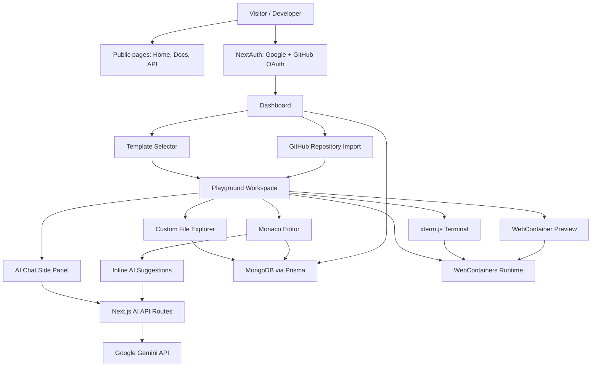
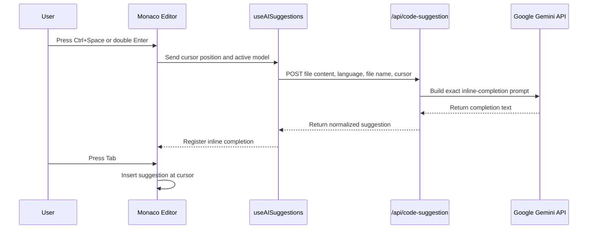

# VibeCode Editor

VibeCode Editor is a full-stack browser IDE built with Next.js App Router, Monaco Editor, WebContainers, xterm.js, NextAuth, MongoDB, and Google Gemini. It gives users a dashboard for creating runnable playgrounds, a VS Code-like editor experience, an embedded terminal, live browser previews, GitHub repository import, and AI-assisted chat plus inline code suggestions.


## Architecture



## Main Functionalities

- Create playgrounds from real starter templates.
- Run React, Next.js, Express, Hono, Vue, and Angular projects in the browser.
- Import public GitHub repositories into a playground.
- Use a custom file explorer to create, rename, delete, and select files/folders.
- Edit code in Monaco with syntax highlighting, language switching, formatting options, and keyboard shortcuts.
- Run commands in an embedded xterm.js terminal.
- Preview WebContainer apps without leaving the workspace.
- Save playground file state through Prisma and MongoDB.
- Sign in with Google or GitHub using NextAuth.
- Toggle dark and light themes.
- Open public Docs, API, Terms, Privacy, Dashboard, Settings, and Playground pages.
- Ask the Gemini chat assistant about the active file.
- Trigger inline AI code suggestions with `Ctrl + Space` or double `Enter`.
- Accept AI suggestions with `Tab` and reject them with `Esc`.

## Tech Stack

| Layer | Tools |
| --- | --- |
| Framework | Next.js 15, App Router, React 19 |
| Language | TypeScript |
| Styling | TailwindCSS, ShadCN UI, Radix UI |
| Authentication | NextAuth with Google and GitHub OAuth |
| Database | MongoDB, Prisma |
| Editor | Monaco Editor |
| Browser Runtime | WebContainers |
| Terminal | xterm.js |
| AI | Google Gemini API |
| Notifications | Sonner |
| Deployment Target | Vercel |

## AI Flow

VibeCode Editor uses Google Gemini for both chat and inline code suggestions.



### AI Chat

- Route: `app/api/chat/route.ts`
- UI: `features/ai-chat/components/ai-chat-sidepanel.tsx`
- Context: active file name, active file content, selected language, and user message history.
- Use case: explain code, refactor snippets, generate files, and insert code into the playground.

### Inline Suggestions

- Route: `app/api/code-suggestion/route.ts`
- Hook: `features/playground/hooks/useAISuggestion.tsx`
- Editor integration: `features/playground/components/playground-editor.tsx`
- Trigger: `Ctrl + Space` or double `Enter`
- Accept: `Tab`
- Reject: `Esc`

The suggestion flow is intentionally small and cursor-aware. The API asks Gemini to return only the code that should be inserted at the cursor, with no markdown fences or explanation.

## Project Structure

```text
app/
  (root)/             Public home, docs, API, terms, privacy
  (auth)/             Sign-in page
  api/                NextAuth, Gemini, template routes
  dashboard/          Protected playground dashboard
  playground/[id]/    Protected IDE workspace
  settings/           Account and environment status

components/
  modal/              Template selector
  providers/          Theme and app providers
  ui/                 ShadCN/Radix primitives

features/
  ai-chat/            Gemini chat UI and message rendering
  auth/               NextAuth helpers and user controls
  dashboard/          Project cards, table, GitHub import
  home/               Header and footer
  playground/         Editor, file explorer, actions, hooks
  webcontainers/      Terminal, preview, runtime services

starter-templates/    Runtime-ready project templates
```

## Environment Variables

Create `.env.local` in the project root:

```env
AUTH_SECRET="your-auth-secret"
AUTH_GOOGLE_ID="your-google-client-id"
AUTH_GOOGLE_SECRET="your-google-client-secret"
AUTH_GITHUB_ID="your-github-client-id"
AUTH_GITHUB_SECRET="your-github-client-secret"
DATABASE_URL="your-mongodb-url"
GEMINI_API_KEY="your-gemini-api-key"
GEMINI_MODEL="gemini-2.5-flash"
NEXTAUTH_URL="http://localhost:3000"
NEXT_PUBLIC_GITHUB_REPO_URL="https://github.com/Vasu0001/vibeCodeEditor"
```

Do not commit `.env.local`. It is ignored by Git.

## Local Setup

```bash
git clone https://github.com/Vasu0001/vibeCodeEditor.git
cd vibeCodeEditor
npm install
npm run dev
```

Open `http://localhost:3000`.

## Production Check

```bash
npm run lint
npm run build
```

## Deployment Notes

Vercel is the best deployment target because this is a Next.js App Router app.

Before deploying:

- Add the same environment variables in Vercel Project Settings.
- Set `NEXTAUTH_URL` to the production URL.
- Add the production callback URLs to Google OAuth and GitHub OAuth apps.
- Make sure the MongoDB connection string allows Vercel connections.
- Keep `GEMINI_API_KEY` server-only. Do not expose it with `NEXT_PUBLIC_`.

Useful docs:

- [Next.js on Vercel](https://vercel.com/docs/concepts/next.js/overview)
- [Vercel environment variables](https://vercel.com/docs/environment-variables)
- [Next.js environment variables](https://nextjs.org/docs/15/app/guides/environment-variables)
- [Gemini API models](https://ai.google.dev/gemini-api/docs/models)

## Key Engineering Work

- Replaced the original local Ollama direction with Gemini API routes.
- Stabilized Monaco inline suggestion state and request cancellation.
- Added real starter files for every supported stack.
- Hardened WebContainer terminal and preview messaging.
- Fixed protected route behavior and unauthenticated navigation.
- Added public Docs, API, Terms, Privacy, and Settings pages.
- Cleaned GitHub repo links so public repo icons point to this repository.
- Kept generated output, dependencies, and secrets out of Git.

## Recruiter-Friendly Summary

VibeCode Editor shows experience with production-grade React architecture, authenticated full-stack flows, browser-based code execution, advanced editor integrations, AI-assisted development, and practical deployment concerns. It is a strong portfolio project because it connects several complex systems into one usable product instead of stopping at UI screens.
